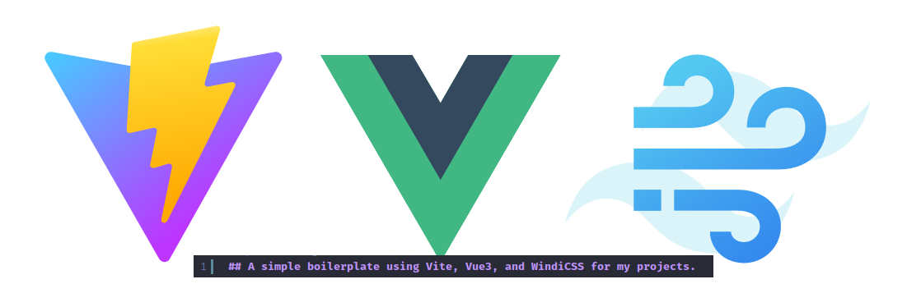

I've been a big fan of TailwindCSS for over half a year. I recently read about the incredible work done by the Wonderful [WindiCSS](https://windicss.org/) team and especially the talented [Mr. Anthony Fu](https://antfu.me/).

He is a Core team member of [Vue](https://vuejs.org/), [Nuxt](http://nuxtjs.org/) and [Vite](http://vitejs.dev/), and a valued Team member of [Windi CSS](https://windicss.org/)

### Features [#](https://windicss.org/integrations/vite.html#features)

-   ⚡️ **It's FAST** - 20~100x times faster than Tailwind on Vite
-   🧩 On-demand CSS utilities (Fully compatible with Tailwind CSS v2)
-   📦 On-demand native elements style resetting (preflight)
-   🔥 Hot module replacement (HMR)
-   🍃 Load configurations from `tailwind.config.js`
-   🤝 Framework-agnostic - Vue, React, Svelte and vanilla!
-   📄 CSS `@apply` / `@screen` directives transforms (also works for Vue SFC's `<style>`)
-   🎳 Support Variant Groups - e.g. `bg-gray-200 hover:(bg-gray-100 text-red-300)`
-   😎 ["Design in Devtools"](https://windicss.org/integrations/vite.html#design-in-devtools) - if you work this way in the traditional Tailwind, no reason we can't!

> Check out the [speed comparison](https://twitter.com/antfu7/status/1361398324587163648) between Windi CSS and Tailwind CSS on Vite.

---

### Installation

`git clone https://github.com/jjaimealeman/vite-vue3-windicss-starter.git`

`npm install`

`npm run dev`

---

If you already know how to style with Tailwind, then Windi should be just as easy.

### To Do
- [ ] Install plugins
- - [ ] aspect-ratio [#](https://windicss.org/plugins/official/aspect-ratio.html)
- - [ ] forms [#](https://windicss.org/plugins/official/forms.html)
- - [ ] filters [#](https://windicss.org/plugins/official/filters.html)
- - [ ] line-clamp [#](https://windicss.org/plugins/official/line-clamp.html)
- - [ ] scroll-snap [#](https://windicss.org/plugins/official/scroll-snap.html)
- - [ ] typography [#](https://windicss.org/plugins/official/typography.html)
- [ ] Create several template pages using Vue Router
